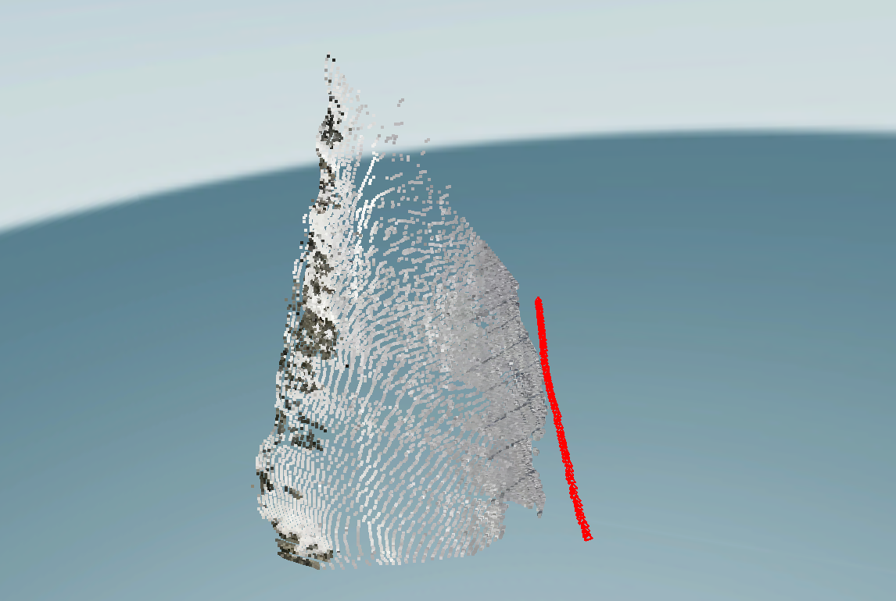

# Self-Use Log

## Remarks
- the input argument `sample_ratio` is effective to balance quality and speed. The higher, the slower and denser the computation/result is.
A good practice would be `sample_ratio=4 or 8`.
- The `sample_ratio` is performed to select a grid of points in a frame. So the frame spatial resolution should be considered as well.
- `skip_path_consistency=True` can speed up but degrade the quality slightly. Perceptually, holes are filled better.
- The algorithm fails when
    - Too large frame jumps, because no point trajectories are produced.
    - textureless regions. One can check the motion_segmentation result videos to check.
- The camera poses and intrinsics are estimated and saved in `colmap_outputs_converted/`. The resultant depth show how dense the points are.

---

## Experiments on the MyCup sequence
- The input sequence is downsampled to 5fps, contain 69 frames of 1280x720 resolution. The camera intrinsics are not given.
- Specifically, provided the original video, we first run the following commands:
```
mkdir -p example/mycup/images
ffmpeg -i example/VID_20221116_171506.mp4 -vf fps=5 example/mycup/images/image_%05d.png
python run_particlesfm.py --image_dir ./example/mycup/images --output_dir ./outputs/mycup/ --sample_ratio=16 --skip_exists --assume_static --skip_path_consistency
```
- Overall, it takes 108.69 seconds, and produces the following
```
{'num_reg_images': 69, 'num_sparse_points': 7492, 'num_observations': 50902, 'mean_track_length': 6.79418, 'num_observations_per_image': 737.710145, 'mean_reproj_error': 0.68212}
```
- The images are saved in `example/mycup`. The results are in `outputs/mycup`. The reconstruction is as follows. Compared to the original video, the it looks quite reasonable. 


---
## Experiments on the Snowboard sequence.
- The input image sequence has 66 frames, and seems to be about 10 fps.
- The following command gives reasonable reconstruction in an efficient manner, which takes `95.633910` seconds.
```
python run_particlesfm.py --image_dir ./example/snowboard/images --output_dir ./outputs/snowboard/ --sample_ratio=8 --skip_path_consistency
```
- The output means a point cloud with 19216 points. The meaning of `num_observations` is unknown to me yet.
```
{'num_reg_images': 66, 'num_sparse_points': 19216, 'num_observations': 164894, 'mean_track_length': 8.581078, 'num_observations_per_image': 2498.393939, 'mean_reproj_error': 0.608517}
```

- When `skip_path_consistency=False`, particlesfm additionally optimizes the point tracking. Then it takes `127.527402` seconds to produce
the following results, with more reconstructed points.
```
{'num_reg_images': 66, 'num_sparse_points': 19561, 'num_observations': 168449, 'mean_track_length': 8.611472, 'num_observations_per_image': 2552.257576, 'mean_reproj_error': 0.615594}
```

- Qualitive comparison: left and right are with and without `skip_path_consistency`, respectively. Perceptually, holes are filled better.





---